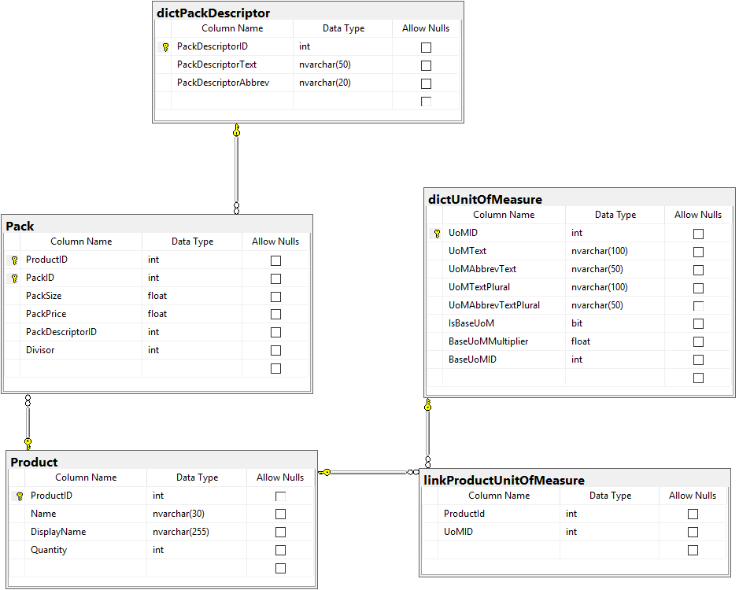

# TradePeg - The Fruit Business

## Database Diagram


## Explanation
I have worked in catering during my time in the Royal Navy so was able to draw on my experience, for this I started out with a simple database schema as shown in the image above, defining a schema that centres around a Product with a link to dictUnitOfMeasure and Pack.

I split the UnitOfMeasure and adopted a Product -> Pack approach.  I felt this would give greater flexibility, for example, thinking about different types of products like cans, jars, etc. which could have different weight units, e.g. cans of baked beans could be 200g, 415g, 420g or 2.62kg.  These are the units of measure and multiple of these when combined make a pack.

For the Pack table this defines the various pack sizes (e.g. Case, Pallet, etc.) and I felt this would be equally as flexible, e.g. in the example a case of Apples will have 10 units and a pallet 40 units (each divisable by 10), equally a case of 2.62kg baked beans would have 6 cans, etc.  This meant that I could define a Pack price for a pallet or a case and use this to calculate the unit price.  The total units in stock are stored against the product, and the total per pack calculated from the pack size.

Using this schema you would be able to identify the Quantity of units (from the Product table), the Pack quantity and the Unit Price for a given Pack as per the SQL statement below

```sql
SELECT p.ProductID
	, p.Name
	, p.Quantity
	, p.Quantity / pack.PackSize / pack.Divisor AS PackQuantity
	, pd.PackDescriptorText
	, pack.PackPrice / pack.PackSize / pack.Divisor AS UnitPrice
	, uom.UoMText
FROM dbo.Product p
	INNER JOIN dbo.Pack pack ON p.ProductID = pack.ProductID
	INNER JOIN dbo.linkProductUnitOfMeasure luom ON luom.ProductId = p.ProductID
	INNER JOIN dbo.dictUnitOfMeasure uom ON luom.UoMID = uom.UoMID
	INNER JOIN dbo.dictUnitOfMeasure buom ON uom.UoMID = buom.BaseUoMID
	INNER JOIN dbo.dictPackDescriptor pd ON pack.PackDescriptorID = pd.PackDescriptorID
WHERE pack.PackID = 2 /* case(s) */
```

The above query would output the following for cases:


or for pallets:


### Files
[TradePeg.sql](TradePeg.sql) - Database script to create database as per the above

I have included example data files in the Data/ directory, these are quoted CSV files.
